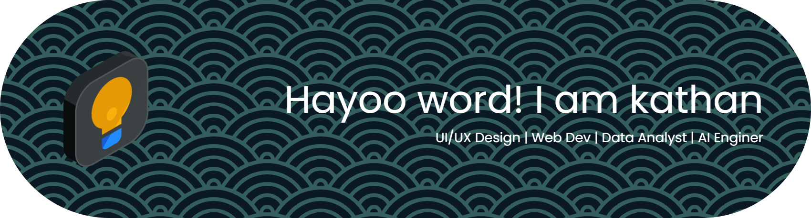

<!-- ## Hi there 👋 -->

<!--  -->

<!-- ##### Skills

                      

##### Connect with me

  -->

## 💫 About Me:

hayoo word ! i'am kathan 👋  🔭 I’m currently working on Building a responsive personal portfolio website using Next.js and Tailwind CSS. 👯 I’m looking to collaborate on Open Source Front-end projects (React) or creating accessible UI Design Systems. 🤝 I’m looking for help with Advanced React patterns and performance optimization techniques. 🌱 I’m currently learning Deepening my understanding of User Experience (UX) research methods and scalable component architecture. 💬 Ask me about React.js, Figma, Tailwind CSS, or Informatics Engineering topics. ⚡ Fun fact When I'm not coding or designing, I love capturing cinematic & vintage style photography 📸.

## 🌐 Socials:

  

## 💻 Tech Stack:

                 

## 📊 GitHub Stats:

 
 

---

###

###

<!-- Proudly created with GPRM ( https://gprm.itsvg.in ) -->
