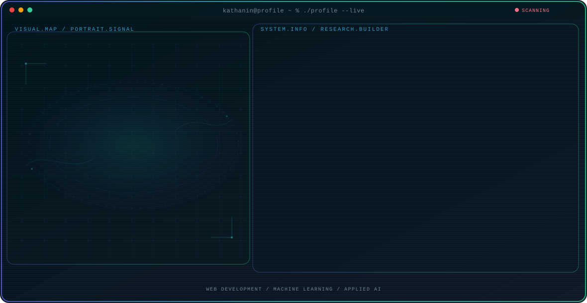

<!-- Generated by GitHub Profile Agent Console. Edit profile.config.json, then run npm run generate. -->

  <picture>
    <source media="(max-width: 760px) and (prefers-color-scheme: dark)" srcset="./assets/hero/agent-console-28959740-mobile-dark.svg">
    <source media="(max-width: 760px)" srcset="./assets/hero/agent-console-28959740-mobile-light.svg">
    <source media="(prefers-color-scheme: dark)" srcset="./assets/hero/agent-console-28959740-dark.svg">
    <source media="(prefers-color-scheme: light)" srcset="./assets/hero/agent-console-28959740-light.svg">
    
  </picture>

  
  

## About Me

I am a Computer Science graduate specializing in full-stack web engineering and predictive machine learning models.

My work focuses on bridging intelligent algorithms with scalable, practical web architectures that deliver real value.

## Current Focus

| Area | What I am exploring |
| --- | --- |
| **Web Development** | Building scalable full-stack applications, robust API integrations, and responsive user interfaces. |
| **Machine Learning** | Developing predictive neural network models, managing data distributions, and deploying Flask APIs. |
| **Applied AI** | Integrating intelligent models into web architectures to deliver automated and user-centric solutions. |
| **UI/UX Design** | Designing intuitive, clean user interfaces and crafting engaging, modern digital experiences. |

## Featured Work

| Project | Focus | Why it matters |
| --- | --- | --- |
| [**ReTrash**](https://github.com/kathanin) | UI/UX Design for Recycling Solutions | A mobile application interface design focused on providing smart environmental recycling solutions. |
| [**Credit Classifier**](https://github.com/kathanin) | Machine Learning & Web Deployment | A web application deploying a neural network model to classify bank customer creditworthiness. |
| [**Personal Portfolio**](https://github.com/kathanin) | Web Development & Frontend Design | The first version of my personal portfolio website built to showcase my web engineering projects. |

## Research Direction

I am focused on designing robust applications that embed machine learning models into clean, modern user interfaces.

## Tech Stack

`TypeScript` · `Next.js` · `React` · `Laravel` · `Tailwind CSS` · `Python` · `TensorFlow` · `Flask API`

## Recent Activity

<!-- AUTO:ACTIVITY:START -->
_Recent public activity will appear here after the workflow runs._
<!-- AUTO:ACTIVITY:END -->

---

  Building intelligent web systems and engineering solutions that deliver impact.

